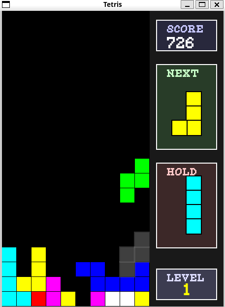

# Tetris

A classic **Tetris** game implemented in C++ using the **SFML** library for graphics. This version offers a complete experience with modern features while keeping the charm of the original game.



## Features

- **Classic Gameplay** - The authentic Tetris experience with falling blocks
- **Ghost Piece** - Visualization of where your piece will land
- **Hold System** - Ability to store a piece for later use
- **Next Piece Preview** - See the upcoming piece
- **Particle Effects** - Visual animation when lines are completed
- **Detailed Scoring System** - Earn more points for combos and Tetris
- **Intuitive User Interface** - Clear display of score, level, and game information
- **Progressive Gravity** - Speed increases progressively with score

## Requirements

- **C++ Compiler** (g++ recommended)
- **SFML Library** (Simple and Fast Multimedia Library)

## Installation

1. Clone the repository:

   ```bash
   git clone git@github.com-Zimori:Zimori/agent-small-games.git
   cd agent-small-games
   ```

2. Install SFML (if not already installed):

   ```bash
   sudo apt-get install libsfml-dev
   ```

3. Compile the game:

   ```bash
   make tetris
   ```

4. Run the game:

   ```bash
   ./bin/tetris
   ```

## How to Play

1. The game starts immediately upon launch
2. Different shaped pieces (called Tetriminos) fall from the top of the screen
3. Manipulate these pieces to create complete horizontal lines without gaps
4. When a line is completed, it disappears and you earn points
5. The game progressively speeds up, making piece placement more challenging
6. The game ends when pieces stack up to the top of the screen

## Controls

| Key                 | Action                                   |
|---------------------|------------------------------------------|
| **Left/Right Arrows** | Move the piece horizontally            |
| **Down Arrow**      | Accelerate the piece's fall (soft drop)  |
| **Up Arrow**        | Rotate the piece clockwise               |
| **Space**           | Hard drop (place the piece instantly)    |
| **C**               | Hold the current piece                   |
| **Escape**          | Quit the game                            |

## Scoring System

- **Single line**: 100 points × current level
- **Double line**: 300 points × current level
- **Triple line**: 500 points × current level
- **Tetris** (4 lines): 800 points × current level
- **Soft drop**: 1 point per cell
- **Hard drop**: 2 points per cell

## Code Architecture

The game is structured around the following concepts:

- Game grid management (collision detection and completed lines)
- Tetrimino manipulation (rotation, movement)
- Graphical rendering system with SFML
- Game state management (playing, paused, game over)

## Dependencies

- **SFML 2.5+** - For graphics, window management, and events
- **Pixel Font** - For rendering text in a retro style

## Future Development

- **Multiplayer Mode** - Play against a friend locally
- **Sound Effects and Music** - Add audio feedback
- **High Score Table** - Save and display top scores
- **Visual Themes** - Different color palettes and graphic styles
- **Marathon Mode** - An endurance challenge with progressive levels

## Troubleshooting

- If you encounter compilation issues related to SFML, verify that the library is properly installed and that paths are correctly configured in the Makefile.
- On some Linux systems, you might need to install additional packages for SFML: `sudo apt-get install libsfml-dev libpthread-stubs0-dev libgl1-mesa-dev libx11-dev libxrandr-dev libfreetype6-dev libglew-dev libjpeg-dev libsndfile1-dev libopenal-dev`

## License

This project is licensed under the MIT License. See the `LICENSE` file for details.

---

Enjoy playing Tetris!
